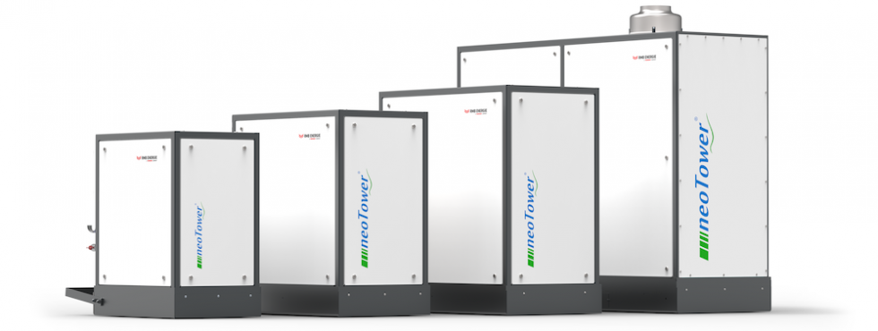

# ioBroker.rmb-bhkw

[](https://www.npmjs.com/package/iobroker.rmb-bhkw)
[](https://www.npmjs.com/package/iobroker.rmb-bhkw)


[](https://nodei.co/npm/iobroker.rmb-bhkw/)

**Tests:** 

## RMB BHKW Adapter für ioBroker

Liest Daten von RMB BHKWs (z.b. Remeha eLina) über das RMB Energie Kundenportal (rmbenergie.com) aus und stellt diese als Objekte in ioBroker zur Verfügung.


## Verwendung

Der Adapter nutzt eine headless-Version des Chromium Browsers um die Daten aus dem Kundenportal zu parsen. Hierzu kann entweder die vom Adapter mitgelieferte Chromium version verwendet werden, oder eine externe. 

# Mitgelieferte Version von Chrome
Wenn die mitgelieferte verwendet werden soll, so müssen auf dem Host-System von ioBroker die Abhängigkeiten von Chromium erfüllt sein. Diese können bei einem Debian/Ubuntu-System nachinstalliert werden mit:

```
sudo apt install -y ca-certificates fonts-liberation libappindicator3-1 libasound2 libatk-bridge2.0-0 libatk1.0-0 libc6 libcairo2 libcups2 libdbus-1-3 libexpat1 libfontconfig1 libgbm1 libgcc1 libglib2.0-0 libgtk-3-0 libnspr4 libnss3 libpango-1.0-0 libpangocairo-1.0-0 libstdc++6 libx11-6 libx11-xcb1 libxcb1 libxcomposite1 libxcursor1 libxdamage1 libxext6 libxfixes3 libxi6 libxrandr2 libxrender1 libxss1 libxtst6 lsb-release wget xdg-utils
```

# Verwendung mit Docker
Läuft ioBroker in einem Docker-Container und der mitgelieferte Browser kann aufgrund fehlender Abhängigkeiten nicht genutzt werden, so empfiehlt es sich den Chromium Browser als separaten Container auszuführen. Hierzu empfiehlt sich z.B. das Image [browserless/chrome]{https://hub.docker.com/r/browserless/chrome/}. Dieses Image kann z.B. mit dem Befehl

```
docker run -p 3000:3000 browserless/chrome
```
ausgeführt werden und ist dann unter `http://[IP-des-docker-hosts]:3000` zu erreichen. Erscheint die Weboberfläche des Containers, so funktioniert er wie erwartet und der entprechende Pfad kann in der Adapterkonfiguration eingegeben werden. 


### Best Practices
We've collected some [best practices](https://github.com/ioBroker/ioBroker.repositories#development-and-coding-best-practices) regarding ioBroker development and coding in general. If you're new to ioBroker or Node.js, you should
check them out. If you're already experienced, you should also take a look at them - you might learn something new :)


### Publishing the adapter
Using GitHub Actions, you can enable automatic releases on npm whenever you push a new git tag that matches the form 
`v<major>.<minor>.<patch>`. We **strongly recommend** that you do. The necessary steps are described in `.github/workflows/test-and-release.yml`.

Since you installed the release script, you can create a new
release simply by calling:
```bash
npm run release
```
Additional command line options for the release script are explained in the
[release-script documentation](https://github.com/AlCalzone/release-script#command-line).

To get your adapter released in ioBroker, please refer to the documentation 
of [ioBroker.repositories](https://github.com/ioBroker/ioBroker.repositories#requirements-for-adapter-to-get-added-to-the-latest-repository).

### Test the adapter manually with dev-server
Since you set up `dev-server`, you can use it to run, test and debug your adapter.

You may start `dev-server` by calling from your dev directory:
```bash
dev-server watch
```

The ioBroker.admin interface will then be available at http://localhost:8081/

Please refer to the [`dev-server` documentation](https://github.com/ioBroker/dev-server#command-line) for more details.

## Changelog
<!--
	Placeholder for the next version (at the beginning of the line):
	### **WORK IN PROGRESS**
-->

### **WORK IN PROGRESS**
* (satchafunkilus) initial release

## License
MIT License

Copyright (c) 2022 satchafunkilus <tobi.as@me.com>

Permission is hereby granted, free of charge, to any person obtaining a copy
of this software and associated documentation files (the "Software"), to deal
in the Software without restriction, including without limitation the rights
to use, copy, modify, merge, publish, distribute, sublicense, and/or sell
copies of the Software, and to permit persons to whom the Software is
furnished to do so, subject to the following conditions:

The above copyright notice and this permission notice shall be included in all
copies or substantial portions of the Software.

THE SOFTWARE IS PROVIDED "AS IS", WITHOUT WARRANTY OF ANY KIND, EXPRESS OR
IMPLIED, INCLUDING BUT NOT LIMITED TO THE WARRANTIES OF MERCHANTABILITY,
FITNESS FOR A PARTICULAR PURPOSE AND NONINFRINGEMENT. IN NO EVENT SHALL THE
AUTHORS OR COPYRIGHT HOLDERS BE LIABLE FOR ANY CLAIM, DAMAGES OR OTHER
LIABILITY, WHETHER IN AN ACTION OF CONTRACT, TORT OR OTHERWISE, ARISING FROM,
OUT OF OR IN CONNECTION WITH THE SOFTWARE OR THE USE OR OTHER DEALINGS IN THE
SOFTWARE.